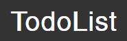
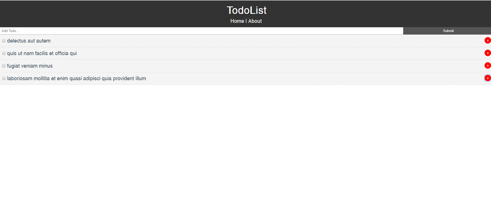

# TodoList  

### This is a study project only. :books:

## :electric_plug: Built with

- VueJS -> 2.6.10
- Vue-router -> 3.0.3
- NPM -> 6.4.1

:newspaper: <a href="https://vuejs.org">Learn about how to start with Vue here.</a>

### <a href="https://www.linkedin.com/in/stefanosaffran/">LinkedIn</a> | <a href="https://stefanosaffran.com">Website</a>